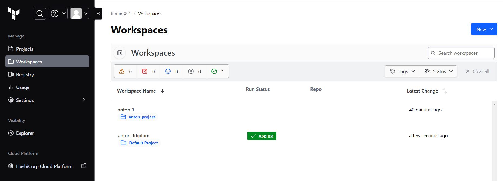

# Дипломный практикум в Yandex.Cloud - Баранков Антон

### Создание облачной инфраструктуры
Для начала необходимо подготовить облачную инфраструктуру в ЯО при помощи Terraform.  

Предварительная подготовка к установке и запуску Kubernetes кластера.  

1. Создайте сервисный аккаунт, который будет в дальнейшем использоваться Terraform для работы с инфраструктурой с необходимыми и достаточными правами. Не стоит использовать права суперпользователя.  


2. Подготовьте backend для Terraform:  
а. Рекомендуемый вариант: S3 bucket в созданном ЯО аккаунте(создание бакета через TF) б. Альтернативный вариант: Terraform Cloud  

Выполнены оба варианта.  
При создании кластера с помощью kuberspray был использован вариант с backend в ЯО.  


При создании кластера Managed Service for Kubernetes использован вариант с Terraform Cloud.  



3. Создайте VPC с подсетями в разных зонах доступности.  

Выполнено, будет видно ниже на скриншотах с созданными ВМ.  

4. Убедитесь, что теперь вы можете выполнить команды terraform destroy и terraform apply без дополнительных ручных действий.  
5. В случае использования Terraform Cloud в качестве backend убедитесь, что применение изменений успешно проходит, используя web-интерфейс Terraform cloud.  

Оба пункта выполнены.  

Ожидаемые результаты:

1. Terraform сконфигурирован и создание инфраструктуры посредством Terraform возможно без дополнительных ручных действий.  
2. Полученная конфигурация инфраструктуры является предварительной, поэтому в ходе дальнейшего выполнения задания возможны изменения.  

### Создание Kubernetes кластера
На этом этапе необходимо создать Kubernetes кластер на базе предварительно созданной инфраструктуры. Требуется обеспечить доступ к ресурсам из Интернета.  

Это можно сделать двумя способами:  

1. Рекомендуемый вариант: самостоятельная установка Kubernetes кластера.  
а. При помощи Terraform подготовить как минимум 3 виртуальных машины Compute Cloud для создания Kubernetes-кластера. Тип виртуальной машины следует выбрать самостоятельно с учётом требовании к производительности и стоимости. Если в дальнейшем поймете, что необходимо сменить тип инстанса, используйте Terraform для внесения изменений.  
б. Подготовить ansible конфигурации, можно воспользоваться, например Kubespray.  
в. Задеплоить Kubernetes на подготовленные ранее инстансы, в случае нехватки каких-либо ресурсов вы всегда можете создать их при помощи Terraform.  
2. Альтернативный вариант: воспользуйтесь сервисом Yandex Managed Service for Kubernetes.  
а. С помощью terraform resource для kubernetes создать региональный мастер kubernetes с размещением нод в разных 3 подсетях.  
б. С помощью terraform resource для kubernetes node group.  
Ожидаемый результат:  

1. Работоспособный Kubernetes кластер.  
2. В файле ~/.kube/config находятся данные для доступа к кластеру.  
3. Команда kubectl get pods --all-namespaces отрабатывает без ошибок.  

Выполнены оба варианта. К сожалению не смог сделать скриншоты подтверждения выполнения первого варианта, т.к. docker стал заблокированным, но все коды исполнялись ранее, потому прилагаю ссылку на папку с кодами terraform и ansible.  

[Ссылка на вариант выполнения кода с установкой кластера с помощью kuberspray](./terraform_ansible_kuberspray)

Также привожу ссылку на создание кластера Yandex Managed Service for Kubernetes с установкой программ, указанных в последующих заданиях, и скриншоты.  

[Ссылка на вариант выполнения кода с установкой кластера Yandex Managed Service for Kubernetes](./terraform_barankov)


### Создание тестового приложения
Для перехода к следующему этапу необходимо подготовить тестовое приложение, эмулирующее основное приложение разрабатываемое вашей компанией.  

Способ подготовки:  

1. Рекомендуемый вариант:  
а. Создайте отдельный git репозиторий с простым nginx конфигом, который будет отдавать статические данные.  
б. Подготовьте Dockerfile для создания образа приложения.  
2. Альтернативный вариант:  
а. Используйте любой другой код, главное, чтобы был самостоятельно создан Dockerfile.  
Ожидаемый результат:  

1. Git репозиторий с тестовым приложением и Dockerfile.  

[Ссылка на репозиторий](https://github.com/barankov-av/nginx)

2. Регистри с собранным docker image. В качестве регистри может быть DockerHub или Yandex Container Registry, созданный также с помощью terraform.  


### Подготовка cистемы мониторинга и деплой приложения
Уже должны быть готовы конфигурации для автоматического создания облачной инфраструктуры и поднятия Kubernetes кластера.  
Теперь необходимо подготовить конфигурационные файлы для настройки нашего Kubernetes кластера.  

Цель:  

1. Задеплоить в кластер prometheus, grafana, alertmanager, экспортер основных метрик Kubernetes.  
2. Задеплоить тестовое приложение, например, nginx сервер отдающий статическую страницу.  
Способ выполнения:  

1. Воспользовать пакетом kube-prometheus, который уже включает в себя Kubernetes оператор для grafana, prometheus, alertmanager и node_exporter. При желании можете собрать все эти приложения отдельно.  
2. Для организации конфигурации использовать qbec, основанный на jsonnet. Обратите внимание на имеющиеся функции для интеграции helm конфигов и helm charts.  
3. Если на первом этапе вы не воспользовались Terraform Cloud, то задеплойте и настройте в кластере atlantis для отслеживания изменений инфраструктуры. Альтернативный вариант 3 задания: вместо Terraform Cloud или atlantis настройте на автоматический запуск и применение конфигурации terraform из вашего git-репозитория в выбранной вами CI-CD системе при любом комите в main ветку. Предоставьте скриншоты работы пайплайна из CI/CD системы.  
Ожидаемый результат:  

1. Git репозиторий с конфигурационными файлами для настройки Kubernetes.  

[Ссылка на автоматически подготавливаемый файл ingress.yaml](./terraform_barankov/ingress.yaml)

2. Http доступ к web интерфейсу grafana.  


3. Дашборды в grafana отображающие состояние Kubernetes кластера.  


4. Http доступ к тестовому приложению.  


### Установка и настройка CI/CD
Осталось настроить ci/cd систему для автоматической сборки docker image и деплоя приложения при изменении кода.  

Цель:  

1. Автоматическая сборка docker образа при коммите в репозиторий с тестовым приложением.  
2. Автоматический деплой нового docker образа.  
Можно использовать teamcity, jenkins, GitLab CI или GitHub Actions.  

Использовал jenkins.  

Ожидаемый результат:  

1. Интерфейс ci/cd сервиса доступен по http.  
2. При любом коммите в репозиторий с тестовым приложением происходит сборка и отправка в регистр Docker образа.  

[Ссылка на pipeline, срабатывающего при пуше коммита](./pipeline_commit)


3. При создании тега (например, v1.0.0) происходит сборка и отправка с соответствующим label в регистри, а также деплой соответствующего Docker образа в кластер Kubernetes.  

Для обеспечения доступа к кластеру выполнил следующие шаги:  

1. Создаю сервисный аккаунт.  
`kubectl create serviceaccount jenkins`  

2. Создаю привязку роли на основе разрешений, необходимых приложению.  
Создаю `role-binding.yaml` с текстом  

```
apiVersion: rbac.authorization.k8s.io/v1
kind: ClusterRoleBinding
metadata:
  name: jenkins-integration
  labels:
    k8s-app: jenkins-image-builder
roleRef:
  apiGroup: rbac.authorization.k8s.io
  kind: ClusterRole
  name: cluster-admin
subjects:
- kind: ServiceAccount
  name: jenkins
  namespace: default
```
Затем выполняю команду `kubectl create -f role-binding.yaml`  

Для получения токена создаю файл `jenkins-secret.yaml` с текстом  

```
apiVersion: v1
kind: Secret
type: kubernetes.io/service-account-token
metadata:
  name: jenkins
  annotations:
    kubernetes.io/service-account.name: jenkins
```

Затем выполняю команду `kubectl create -f jenkins-secret.yaml`  

Далее выполняю команду `kubectl get secrets jenkins -o jsonpath='{.data.token}' | base64 -d`  

На основе полученных данных создаю `credentials kubernetes_token` в Jenkins.  

[Ссылка на pipeline, периодически опрашивающего репозиторий на предмет появления новых тегов](./pipeline_tag)

[Ссылка на сообщение jenkins о выполнении pipeline](./message_pipeline_tag)


