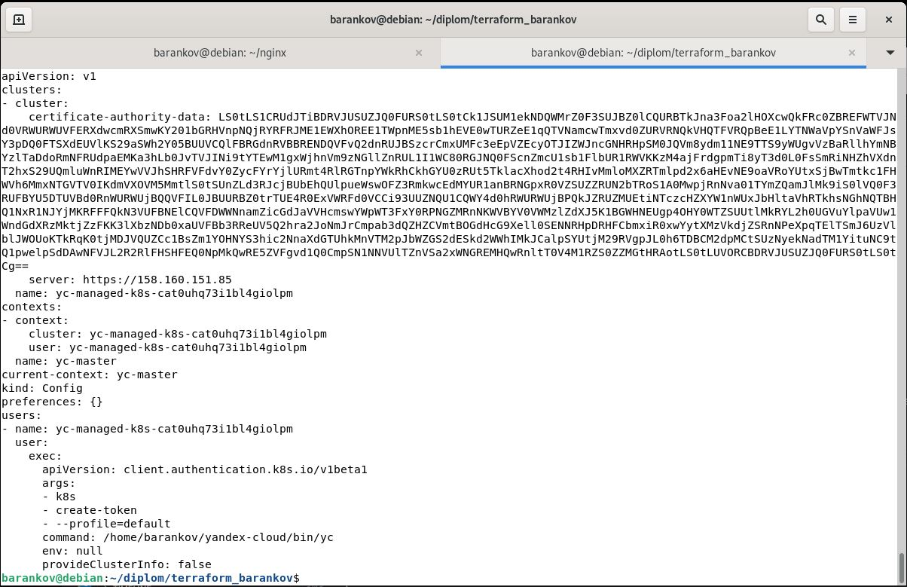
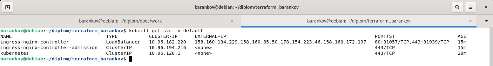

# Дипломный практикум в Yandex.Cloud - Баранков Антон

### Создание облачной инфраструктуры
Для начала необходимо подготовить облачную инфраструктуру в ЯО при помощи Terraform.  

Предварительная подготовка к установке и запуску Kubernetes кластера.  

1. Создайте сервисный аккаунт, который будет в дальнейшем использоваться Terraform для работы с инфраструктурой с необходимыми и достаточными правами. Не стоит использовать права суперпользователя.  


2. Подготовьте backend для Terraform:  
а. Рекомендуемый вариант: S3 bucket в созданном ЯО аккаунте(создание бакета через TF) б. Альтернативный вариант: Terraform Cloud  

Выполнены оба варианта.  
При создании кластера с помощью kuberspray был использован вариант с backend в ЯО.  


При создании кластера Managed Service for Kubernetes использован вариант с Terraform Cloud.  


3. Создайте VPC с подсетями в разных зонах доступности.  

Выполнено, будет видно ниже на скриншотах с созданными ВМ.  

4. Убедитесь, что теперь вы можете выполнить команды terraform destroy и terraform apply без дополнительных ручных действий.  
5. В случае использования Terraform Cloud в качестве backend убедитесь, что применение изменений успешно проходит, используя web-интерфейс Terraform cloud.  

Оба пункта выполнены.  

Ожидаемые результаты:

1. Terraform сконфигурирован и создание инфраструктуры посредством Terraform возможно без дополнительных ручных действий.  
2. Полученная конфигурация инфраструктуры является предварительной, поэтому в ходе дальнейшего выполнения задания возможны изменения.  

### Создание Kubernetes кластера
На этом этапе необходимо создать Kubernetes кластер на базе предварительно созданной инфраструктуры. Требуется обеспечить доступ к ресурсам из Интернета.  

Это можно сделать двумя способами:  

1. Рекомендуемый вариант: самостоятельная установка Kubernetes кластера.  
а. При помощи Terraform подготовить как минимум 3 виртуальных машины Compute Cloud для создания Kubernetes-кластера. Тип виртуальной машины следует выбрать самостоятельно с учётом требовании к производительности и стоимости. Если в дальнейшем поймете, что необходимо сменить тип инстанса, используйте Terraform для внесения изменений.  
б. Подготовить ansible конфигурации, можно воспользоваться, например Kubespray.  
в. Задеплоить Kubernetes на подготовленные ранее инстансы, в случае нехватки каких-либо ресурсов вы всегда можете создать их при помощи Terraform.  
2. Альтернативный вариант: воспользуйтесь сервисом Yandex Managed Service for Kubernetes.  
а. С помощью terraform resource для kubernetes создать региональный мастер kubernetes с размещением нод в разных 3 подсетях.  
б. С помощью terraform resource для kubernetes node group.  
Ожидаемый результат:  

1. Работоспособный Kubernetes кластер.  
2. В файле ~/.kube/config находятся данные для доступа к кластеру.  
3. Команда kubectl get pods --all-namespaces отрабатывает без ошибок.  

Выполнены оба варианта. К сожалению не смог сделать скриншоты подтверждения выполнения первого варианта, т.к. docker стал заблокированным, но все коды исполнялись ранее, потому прилагаю ссылку на папку с кодами terraform и ansible.  

[Ссылка на вариант выполнения кода с установкой кластера с помощью kuberspray](./terraform_ansible_kuberspray)

Также привожу ссылку на создание кластера Yandex Managed Service for Kubernetes с установкой программ, указанных в последующих заданиях, и скриншоты.  

[Ссылка на вариант выполнения кода с установкой кластера Yandex Managed Service for Kubernetes](./terraform_barankov)





### Создание тестового приложения
Для перехода к следующему этапу необходимо подготовить тестовое приложение, эмулирующее основное приложение разрабатываемое вашей компанией.  

Способ подготовки:  

1. Рекомендуемый вариант:  
а. Создайте отдельный git репозиторий с простым nginx конфигом, который будет отдавать статические данные.  
б. Подготовьте Dockerfile для создания образа приложения.  
2. Альтернативный вариант:  
а. Используйте любой другой код, главное, чтобы был самостоятельно создан Dockerfile.  
Ожидаемый результат:  

1. Git репозиторий с тестовым приложением и Dockerfile.  

[Ссылка на репозиторий](https://github.com/barankov-av/nginx)

2. Регистри с собранным docker image. В качестве регистри может быть DockerHub или Yandex Container Registry, созданный также с помощью terraform.  


### Подготовка cистемы мониторинга и деплой приложения
Уже должны быть готовы конфигурации для автоматического создания облачной инфраструктуры и поднятия Kubernetes кластера.  
Теперь необходимо подготовить конфигурационные файлы для настройки нашего Kubernetes кластера.  

Цель:  

1. Задеплоить в кластер prometheus, grafana, alertmanager, экспортер основных метрик Kubernetes.  
2. Задеплоить тестовое приложение, например, nginx сервер отдающий статическую страницу.  
Способ выполнения:  

1. Воспользовать пакетом kube-prometheus, который уже включает в себя Kubernetes оператор для grafana, prometheus, alertmanager и node_exporter. При желании можете собрать все эти приложения отдельно.  
2. Для организации конфигурации использовать qbec, основанный на jsonnet. Обратите внимание на имеющиеся функции для интеграции helm конфигов и helm charts.  
3. Если на первом этапе вы не воспользовались Terraform Cloud, то задеплойте и настройте в кластере atlantis для отслеживания изменений инфраструктуры. Альтернативный вариант 3 задания: вместо Terraform Cloud или atlantis настройте на автоматический запуск и применение конфигурации terraform из вашего git-репозитория в выбранной вами CI-CD системе при любом комите в main ветку. Предоставьте скриншоты работы пайплайна из CI/CD системы.  
Ожидаемый результат:  

1. Git репозиторий с конфигурационными файлами для настройки Kubernetes.  

[Ссылка на автоматически подготавливаемый файл ingress.yaml](./terraform_ansible_kuberspray/ingress.yaml)

2. Http доступ к web интерфейсу grafana.  




3. Дашборды в grafana отображающие состояние Kubernetes кластера.  


4. Http доступ к тестовому приложению.  


### Установка и настройка CI/CD
Осталось настроить ci/cd систему для автоматической сборки docker image и деплоя приложения при изменении кода.  

Цель:  

1. Автоматическая сборка docker образа при коммите в репозиторий с тестовым приложением.  
2. Автоматический деплой нового docker образа.  
Можно использовать teamcity, jenkins, GitLab CI или GitHub Actions.  

Использовал jenkins.  

Ожидаемый результат:  

1. Интерфейс ci/cd сервиса доступен по http.  
2. При любом коммите в репозиторий с тестовым приложением происходит сборка и отправка в регистр Docker образа.  

[Ссылка на pipeline, срабатывающего при пуше коммита](./pipeline_commit)


3. При создании тега (например, v1.0.0) происходит сборка и отправка с соответствующим label в регистри, а также деплой соответствующего Docker образа в кластер Kubernetes.  

Для обеспечения доступа к кластеру выполнил следующие шаги:  

1. Создаю сервисный аккаунт.  
`kubectl create serviceaccount jenkins`  

2. Создаю привязку роли на основе разрешений, необходимых приложению.  
Создаю `role-binding.yaml` с текстом  

```
apiVersion: rbac.authorization.k8s.io/v1
kind: ClusterRoleBinding
metadata:
  name: jenkins-integration
  labels:
    k8s-app: jenkins-image-builder
roleRef:
  apiGroup: rbac.authorization.k8s.io
  kind: ClusterRole
  name: cluster-admin
subjects:
- kind: ServiceAccount
  name: jenkins
  namespace: default
```
Затем выполняю команду `kubectl create -f role-binding.yaml`  

Для получения токена создаю файл `jenkins-secret.yaml` с текстом  

```
apiVersion: v1
kind: Secret
type: kubernetes.io/service-account-token
metadata:
  name: jenkins
  annotations:
    kubernetes.io/service-account.name: jenkins
```

Затем выполняю команду `kubectl create -f jenkins-secret.yaml`  

Далее выполняю команду `kubectl get secrets jenkins -o jsonpath='{.data.token}' | base64 -d`  

На основе полученных данных создаю `credentials kubernetes_token` в Jenkins.  

[Ссылка на pipeline, периодически опрашивающего репозиторий на предмет появления новых тегов](./pipeline_tag)

<details><summary>Результат выполнения pipeline</summary>
Started by timer
[Pipeline] Start of Pipeline
[Pipeline] node
Running on Jenkins in /var/lib/jenkins/workspace/Tag
[Pipeline] {
[Pipeline] withCredentials
Masking supported pattern matches of $YANDEX_REGISTRY_CREDS
[Pipeline] {
[Pipeline] withEnv
[Pipeline] {
[Pipeline] stage
[Pipeline] { (Deploy)
[Pipeline] script
[Pipeline] {
[Pipeline] git
Selected Git installation does not exist. Using Default
The recommended git tool is: NONE
No credentials specified
 > git rev-parse --resolve-git-dir /var/lib/jenkins/workspace/Tag/.git # timeout=10
Fetching changes from the remote Git repository
 > git config remote.origin.url https://github.com/barankov-av/nginx.git # timeout=10
Fetching upstream changes from https://github.com/barankov-av/nginx.git
 > git --version # timeout=10
 > git --version # 'git version 2.34.1'
 > git fetch --tags --force --progress -- https://github.com/barankov-av/nginx.git +refs/heads/*:refs/remotes/origin/* # timeout=10
 > git rev-parse refs/remotes/origin/master^{commit} # timeout=10
Checking out Revision f59fdef706f605e6de3feac818118e60e8fe27f2 (refs/remotes/origin/master)
 > git config core.sparsecheckout # timeout=10
 > git checkout -f f59fdef706f605e6de3feac818118e60e8fe27f2 # timeout=10
 > git branch -a -v --no-abbrev # timeout=10
 > git branch -D master # timeout=10
 > git checkout -b master f59fdef706f605e6de3feac818118e60e8fe27f2 # timeout=10
Commit message: "commit"
 > git rev-list --no-walk f59fdef706f605e6de3feac818118e60e8fe27f2 # timeout=10
[Pipeline] sh
+ git tag --points-at HEAD
+ tail -n 1
[Pipeline] sh
+ cat /var/lib/jenkins/workspace/kluster/content.txt
[Pipeline] sh
+ cat /var/lib/jenkins/workspace/kluster/tag.txt
[Pipeline] sh
+ docker build -t cr.yandex/crpsg85c77h25a1cb032/nginx-image:v1.0.0 .
#0 building with "default" instance using docker driver

#1 [internal] load build definition from dockerfile
#1 transferring dockerfile: 142B done
#1 DONE 0.1s

#2 [internal] load metadata for docker.io/library/nginx:alpine
#2 DONE 0.6s

#3 [internal] load .dockerignore
#3 transferring context: 2B done
#3 DONE 0.0s

#4 [1/3] FROM docker.io/library/nginx:alpine@sha256:69f8c2c72671490607f52122be2af27d4fc09657ff57e42045801aa93d2090f7
#4 DONE 0.0s

#5 [internal] load build context
#5 transferring context: 62B done
#5 DONE 0.1s

#6 [2/3] COPY nginx.conf /etc/nginx/conf.d/default.conf
#6 CACHED

#7 [3/3] COPY index.html /usr/share/nginx/html
#7 CACHED

#8 exporting to image
#8 exporting layers done
#8 writing image sha256:dd73d8d5760b860c9bbf103dc596d5ef44265a6ca19a693f6b585ee285b60dd1 0.0s done
#8 naming to cr.yandex/crpsg85c77h25a1cb032/nginx-image:v1.0.0 0.0s done
#8 DONE 0.0s
[Pipeline] sh
Warning: A secret was passed to "sh" using Groovy String interpolation, which is insecure.
		 Affected argument(s) used the following variable(s): [YANDEX_REGISTRY_CREDS]
		 See https://jenkins.io/redirect/groovy-string-interpolation for details.
+ cat ****
+ docker login -u json_key --password-stdin cr.yandex
WARNING! Your password will be stored unencrypted in /var/lib/jenkins/.docker/config.json.
Configure a credential helper to remove this warning. See
https://docs.docker.com/engine/reference/commandline/login/#credentials-store

Login Succeeded
[Pipeline] sh
+ docker push cr.yandex/crpsg85c77h25a1cb032/nginx-image:v1.0.0
The push refers to repository [cr.yandex/crpsg85c77h25a1cb032/nginx-image]
ad9b1576bb5c: Preparing
5b704014d28c: Preparing
9cba8117003a: Preparing
b6d04dc5ecf7: Preparing
d38ed9b519d2: Preparing
3b4115e2edd1: Preparing
8d720e2faad3: Preparing
7b87df18a0ed: Preparing
a05d3326ce5a: Preparing
d4fc045c9e3a: Preparing
8d720e2faad3: Waiting
7b87df18a0ed: Waiting
a05d3326ce5a: Waiting
d4fc045c9e3a: Waiting
3b4115e2edd1: Waiting
ad9b1576bb5c: Layer already exists
9cba8117003a: Layer already exists
5b704014d28c: Layer already exists
b6d04dc5ecf7: Layer already exists
d38ed9b519d2: Layer already exists
3b4115e2edd1: Layer already exists
8d720e2faad3: Layer already exists
a05d3326ce5a: Layer already exists
d4fc045c9e3a: Layer already exists
7b87df18a0ed: Layer already exists
v1.0.0: digest: sha256:b83e7dbd1b360589d985605076fac4b733cc3636792016bd8d80865d487957a5 size: 2403
[Pipeline] sh
+ echo 
apiVersion: apps/v1
kind: Deployment
metadata:
  name: app
  namespace: monitoring
spec:
  replicas: 2
  selector:
    matchLabels:
      app: app
  template:
    metadata:
      labels:
        app: app
    spec:
      containers:
        - name: nginx-image
          image: cr.yandex/crpsg85c77h25a1cb032/nginx-image:v1.0.0
          imagePullPolicy: Always
          ports:
            - containerPort: 80
              protocol: TCP

[Pipeline] withKubeCredentials
[Pipeline] {
[Pipeline] sh
+ curl -LO https://storage.googleapis.com/kubernetes-release/release/v1.20.5/bin/linux/amd64/kubectl
  % Total    % Received % Xferd  Average Speed   Time    Time     Time  Current
                                 Dload  Upload   Total   Spent    Left  Speed

  0     0    0     0    0     0      0      0 --:--:-- --:--:-- --:--:--     0
  2 38.3M    2  834k    0     0   955k      0  0:00:41 --:--:--  0:00:41  955k
 79 38.3M   79 30.6M    0     0  16.3M      0  0:00:02  0:00:01  0:00:01 16.3M
100 38.3M  100 38.3M    0     0  18.2M      0  0:00:02  0:00:02 --:--:-- 18.3M
[Pipeline] sh
+ chmod u+x ./kubectl
[Pipeline] sh
+ ./kubectl apply -f deployment.yaml
Warning: resource deployments/app is missing the kubectl.kubernetes.io/last-applied-configuration annotation which is required by kubectl apply. kubectl apply should only be used on resources created declaratively by either kubectl create --save-config or kubectl apply. The missing annotation will be patched automatically.
deployment.apps/app configured
[Pipeline] }
[kubernetes-cli] kubectl configuration cleaned up
[Pipeline] // withKubeCredentials
[Pipeline] sh
+ echo v1.0.0
[Pipeline] }
[Pipeline] // script
[Pipeline] }
[Pipeline] // stage
[Pipeline] }
[Pipeline] // withEnv
[Pipeline] }
[Pipeline] // withCredentials
[Pipeline] }
[Pipeline] // node
[Pipeline] End of Pipeline
Finished: SUCCESS
</details>


